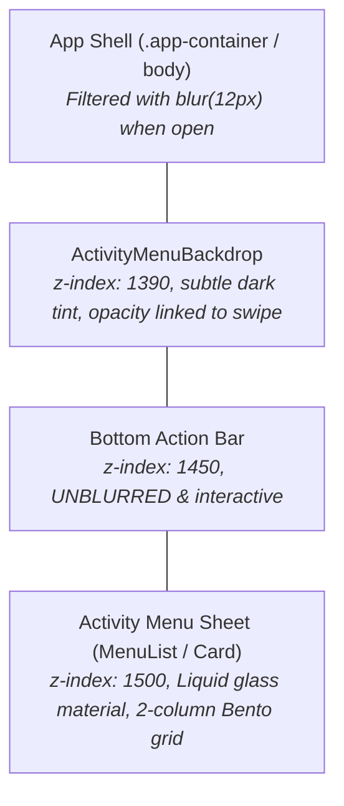
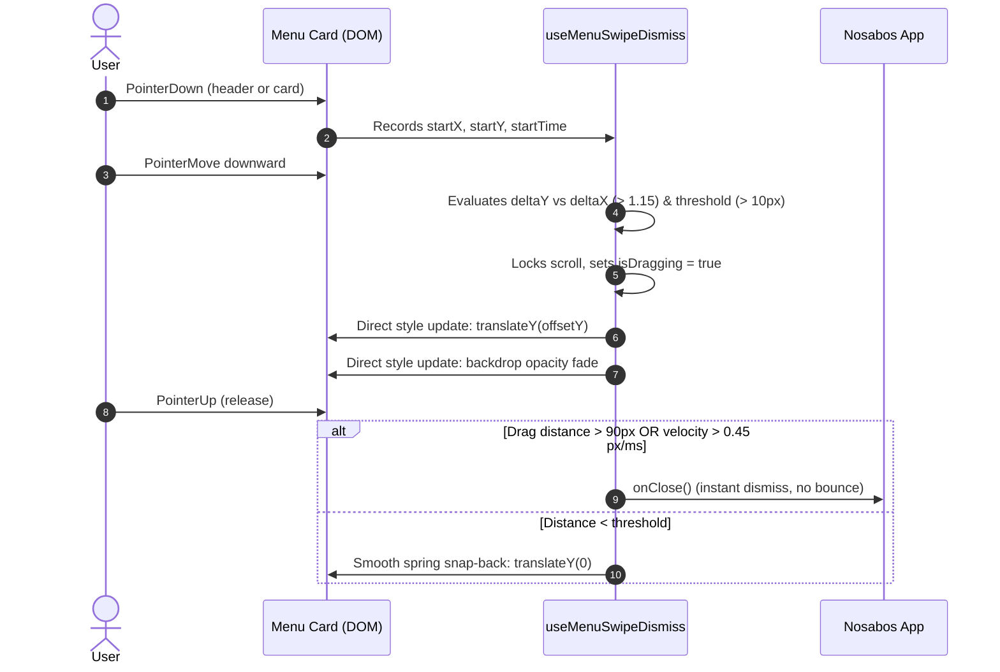

# Activity Menu: Surface Design & Drag-to-Dismiss Architecture

This document provides a comprehensive technical overview of the Activity Menu surface in **Nosabos**, detailing:
1. **Visual & Surface Styling Architecture** (Liquid glass, Bento box grid, selective app background blur, unblurred action bar, header geometry, focus management).
2. **Drag-to-Dismiss Gesture System** (Pointer gesture tracking, non-passive scroll lock, threshold detection, hardware-accelerated DOM transforms, zero-bounce dismissal).

---

## 1. Surface Design & Styling System

The Activity Menu transforms a standard popup menu into a native-feeling mobile sheet / Bento dashboard that floats directly above the application's bottom navigation bar.



### 1.1 Stacking Context & Selective Blur

A critical design requirement was providing an immersive background blur for the underlying app canvas **without** blurring the bottom action bar.

- **Stacking Layers**:
  - Main App Content: `z-index: 1`
  - `ActivityMenuBackdrop`: `z-index: 1390`
  - Bottom Action Bar: `z-index: 1450`
  - `ActivityMenuPortal` (`MenuList` & card): `z-index: 1500`
- **Selective CSS Blur**:
  Instead of applying a blur filter to the entire window or inside the menu backdrop (which would obscure the bottom bar), an attribute selector in `src/index.css` triggers when the menu is open:
  ```css
  html[data-activity-menu-open="true"] #root > .app-container {
    filter: blur(12px);
    transition: filter 0.2s cubic-bezier(0.16, 1, 0.3, 1);
  }
  ```
  Because the bottom action bar is elevated to `z-index: 1450` and isolated from the filtered container, it stays pin-sharp and visually connected to the floating menu.

---

### 1.2 The Liquid Glass Bento Box

The floating card utilizes a responsive 2-column Bento grid with frosted glass aesthetics:

```
+-------------------------------------------------------------+
|                          ======                       [ X ] | <- Drag Handle Row (minH: 32px)
|                                                             | <- Generous pb: 14px-16px
| +---------------------------------------------------------+ |
| |  [<-]  Exit lesson / Game Modes (Full Width Row)       | |
| +---------------------------------------------------------+ |
|                                                             |
| +---------------------------+ +---------------------------+ |
| | [Icon]                    | | [Icon]                    | |
| |                           | |                           | |
| | Label (bottom-left)       | | Label (bottom-left)       | |
| +---------------------------+ +---------------------------+ |
| +---------------------------+ +---------------------------+ |
| | [Icon]                    | | [Icon]                    | |
| |                           | |                           | |
| | Label (bottom-left)       | | Label (bottom-left)       | |
| +---------------------------+ +---------------------------+ |
+-------------------------------------------------------------+
```

#### Key Styling Tokens:
- **Card Material**:
  - Background: `rgba(247, 243, 237, 0.94)` (light mode) / `rgba(26, 26, 26, 0.94)` (dark mode).
  - Backdrop Filter: `blur(24px) saturate(180%)`.
  - Border: Solid `2px` / `2.5px` border with `rgba(180, 164, 144, 0.65)` (light) / `var(--app-border-strong)` (dark).
  - Corner Radius: Rounded `24px` / `28px`.
  - Max Height: `min(580px, calc(100dvh - 96px))`.
- **Bento Tile Layout**:
  - Grid: `gridTemplateColumns="repeat(2, minmax(0, 1fr))"` with `gap={{ base: 2, sm: 2.5 }}`.
  - Icon & Label Alignment: Icons sit above labels with text pinned to the bottom-left (`alignItems="flex-start"`, `justifyContent="flex-end"`).
  - Active Press Feedback: Instant tactile feedback with `transform: scale(0.97)` on `_active`.

---

### 1.3 Drag Handle & Header Spacing

To eliminate visual crowding between the header controls and the menu buttons below:
- **Inner Header Row (`minH="32px"`)**: Houses both the pill drag indicator and the close button in a single flex container.
  - **Pill Drag Handle**: Centered pill (`48px × 5px`, `borderRadius="full"`) matching native drawer handles.
  - **Close 'X' Button**: Circular touch target (`32px × 32px`) with a `13px` close icon, absolute-positioned to the top-right corner and vertically centered.
- **Vertical Clearance**:
  - Top padding: `pt={{ base: 1.5, sm: 2 }}` keeps the pill close to the top boundary.
  - Bottom padding: `pb={{ base: 3.5, sm: 4 }}` (14px–16px). Combined with the grid gap (8px–10px), this provides **~24px–26px of clean breathing room** above the "Exit lesson" or top Bento row.

---

### 1.4 Focus Management & Accessibility

By default, Chakra UI's `<Menu>` selects the first available menu item upon opening (`autoSelect={true}`), which inadvertently applied a bright blue focus ring (`_focusVisible`) to the "Exit lesson" button on touch or mouse click.

- **Solution**: Set `autoSelect={false}` on `<Menu>`.
- **Result**:
  - Opening the menu does **not** highlight or target any item.
  - Keyboard users can still navigate sequentially using the `Tab` key or arrow keys.
  - Interactive buttons retain focus styles only when engaged via keyboard navigation (`_focusVisible`).

---

### 1.5 Context-Aware Placement: Activity Bars (Bottom-Left) vs Non-Activity Bars (Center)

The application features two distinct bottom bar layouts with distinct physical anchoring requirements:

1. **Activity-Based Action Bars (`QuestionActionArea`)**:
   - The action bar is a wide, lesson-centric container holding response inputs and submit buttons.
   - The menu trigger button is situated at the **bottom-left** (`insetInlineStart: min(12px, ...)`).
   - **Configuration**: Uses `placement="top-start"`.
   - **Behavior**: The card aligns to the bottom-left above the trigger button, and Chakra's transform origin is set to `bottom left`. The menu expands from and dismisses/closes directly to the bottom-left trigger button where the user tapped.

2. **Non-Activity Action Bars (`CompactActionBar`)**:
   - On navigation screens (e.g. Skill Tree), the bar collapses into a compact 66px squircle floating in the **dead center** of the viewport.
   - The menu trigger button is centered horizontally.
   - **Configuration**: Uses `placement="top"`.
   - **Behavior**: The card is horizontally centered over the container, and the transform origin is dynamically set to `bottom center`. The menu expands from and dismisses/closes directly to the center compact pill.

In `matchActionBarModifier`, the positioning and CSS transform origin adapt automatically based on `state.placement`:
```javascript
const isCenterAligned = state.placement === "top";
state.styles.popper = {
  ...state.styles.popper,
  width: `${barWidth}px`,
  maxWidth: `${barWidth}px`,
  transformOrigin: isCenterAligned ? "bottom center" : "bottom left",
};
```

---

## 2. Drag-to-Dismiss Gesture System

The menu incorporates a custom gesture engine via the `useMenuSwipeDismiss` hook in `src/components/ActivityMenu.jsx`.



### 2.1 Preventing Scroll Contention & Page Pull

On mobile touch devices, dragging downward inside an open modal or menu can cause the browser to scroll the background page instead of moving the menu. We solved this with a two-tier lock:

1. **Body Scroll Lock**:
   When the menu is open, `document.documentElement` receives `data-activity-menu-open="true"`.
   ```css
   html[data-activity-menu-open="true"],
   body[data-activity-menu-open="true"] {
     overflow: hidden !important;
     touch-action: none !important;
     overscroll-behavior: none !important;
   }
   ```
2. **Non-Passive Touch Interception**:
   A global `touchmove` listener is mounted with `{ passive: false }`. When the user is swiping down, the gesture handler invokes `e.preventDefault()`, stopping native pull-to-refresh or background bounce in its tracks:
   ```javascript
   const handleTouchMove = (e) => {
     if (gestureRef.current?.hasActivated) {
       e.preventDefault();
     }
   };
   window.addEventListener("touchmove", handleTouchMove, { passive: false });
   ```

---

### 2.2 Activation Logic & Intent Filtering

To ensure regular taps, scrolls within the menu, or horizontal interactions are not misinterpreted as dismiss gestures:

1. **Touch Target Inspection**:
   - Tapping the 'X' button immediately exits and skips gesture tracking (`e.target.closest("button[aria-label='Close menu']")`).
   - Dragging the pill handle (`data-drag-handle`) activates quickly (threshold: `10px`).
   - Dragging the card body requires a slightly higher threshold (`14px`) and only activates if the card's internal scroll position is at the very top (`scrollTop <= 0`).
2. **Directional Ratio Guard**:
   - Vertical displacement must exceed horizontal displacement by at least 15% (`deltaY > deltaX * 1.15`) before gesture activation engages.

---

### 2.3 Hardware-Accelerated Direct Transforms

Triggering React state updates (`setState`) on every touch move causes frame drops and sluggish animations. Instead, `useMenuSwipeDismiss` mutates DOM styles directly on `cardRef.current` and `backdropRef.current`:

```javascript
// Applied directly to DOM node without React re-render:
card.style.transform = `translateY(${offsetY}px)`;
card.style.transition = "none";

// Backdrop opacity linked dynamically:
backdrop.style.opacity = String(Math.max(0.1, 1 - offsetY / 240));
```

---

### 2.4 Zero-Bounce Instant Dismiss

In earlier iterations, releasing the card past the dismiss threshold triggered a secondary delayed CSS slide-off animation via `setTimeout`. This created an unnatural "bounce and wait" effect before the menu unmounted.

**The Fix**:
- When the threshold (`offsetY > 90px` or downward velocity `velocityY > 0.45 px/ms`) is reached, `isClosingRef.current` is flagged.
- The card's current offset is retained (preventing snapping back to zero).
- `onClose()` is invoked immediately, transitioning cleanly into Chakra's native exit lifecycle without any rubber-band or bounce artifacts.

---

## 3. Key Files & Reference Table

| File | Purpose |
| :--- | :--- |
| [`src/components/ActivityMenu.jsx`](file:///Users/sheilferzepeda/Desktop/nosabos-x/nosabos/nosabos/src/components/ActivityMenu.jsx) | Main menu component, `useMenuSwipeDismiss` hook, header layout, bento grid, and `autoSelect={false}` config. |
| [`src/index.css`](file:///Users/sheilferzepeda/Desktop/nosabos-x/nosabos/nosabos/src/index.css) | Body scroll locks (`overflow: hidden`), app-container background blur filter (`blur(12px)`), and z-index elevations (`1390`, `1450`, `1500`). |
| [`src/App.jsx`](file:///Users/sheilferzepeda/Desktop/nosabos-x/nosabos/nosabos/src/App.jsx) | Integration site providing menu actions (Exit lesson, Practice tasks, Settings, Notes, Help Chat). |

---

## 4. Verification & Status

- **Automated Tests**: All 515 test suites pass (`npm test`).
- **Production Compilation**: Clean Vite build with zero syntax or bundling errors (`npm run build`).
- **Focus Verification**: Verified that opening the menu leaves all tiles in an unselected neutral state without automatic focus rings.
