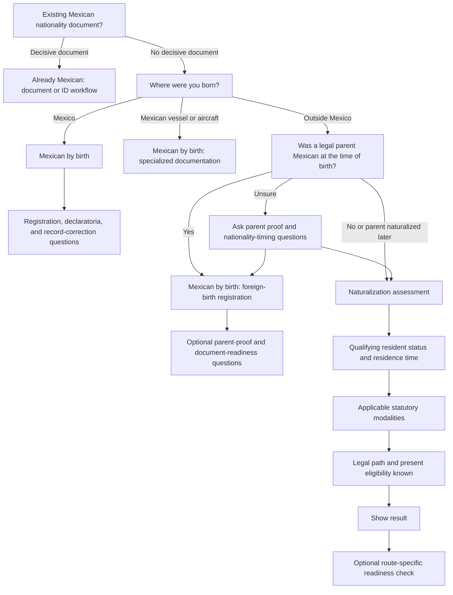

# Citizenship Adaptive Questionnaire Plan

Status: Implemented; qualified Mexican nationality review pending before production rollout
Product surface: `/citizenship`  
Primary implementation: `src/components/CitizenshipGuide.jsx`  
Prepared: July 22, 2026

## Implementation Record

Implemented July 23, 2026.

- The deterministic assessment, question planner, question definitions, legal
  rule metadata, stable checklist items, and version-3 persistence migration
  now live in `src/features/citizenship/`.
- The questionnaire uses stable question IDs and visited history, prunes
  invalid downstream answers, stops at the first conclusive result, and opens
  a persisted checkpoint where users can review the current result, check for
  possible document or filing issues, or continue directly to final results.
- Reports and assistant context contain only applicable answered questions and
  include the structured legal basis, workflow, and status.
- Firestore stores bounded questionnaire and checklist state in
  `users/{npub}/citizenship/progress`, with saved assistant messages under
  `users/{npub}/citizenship/chat/messages/{messageId}`. Existing
  `users/{npub}.citizenshipProgress` maps are migrated forward and removed
  only after the dedicated documents are written successfully.
- The decision fixtures, navigation behavior, migration, invalidation, and
  adaptive localization have automated coverage.
- Production build, targeted lint, desktop flow, and a 390-pixel mobile flow
  were validated. Repository-wide lint still reports pre-existing errors
  outside this feature.
- Legal rule metadata was checked against the primary sources in the
  **Official Reference Baseline**. This implementation remains an eligibility
  guide and still requires the planned review by a qualified Mexican
  nationality professional before production rollout.

## Objective

Make the citizenship questionnaire adaptive so that users answer only the questions that can still affect their legal path, present eligibility, review status, or route-specific preparation checklist.

The product should provide a useful result as soon as the legal path is sufficiently determined. Questions that only improve document readiness or checklist personalization should be offered afterward through an optional **Refine my checklist** step.

The routing must remain deterministic, explainable, testable, and independent of the AI assistant.

## Current State

The questionnaire currently defines 32 questions in `CitizenshipGuide.jsx`. Existing conditions distinguish some Mexico-born questions from foreign-born questions, but the entire naturalization section remains visible to nearly everyone.

Approximate current question counts are:

- Mexico-born applicant: 23 questions
- Foreign-born applicant: 29 questions
- Applicant with an existing decisive Mexican document: at least 20 questions

The route evaluator runs continuously against answers that default to empty values. Consequently, the presence of a route in the current evaluation is not evidence that the questionnaire has collected enough information. Adaptive routing will require an explicit completeness and next-question model.

## Current Route Audit

The existing evaluator produces seven route codes:

| Route | Current label | Current purpose | Main concern |
| --- | --- | --- | --- |
| R1 | Already Mexican by birth | Document/passport workflow for someone already considered Mexican | A Carta de Naturalización also produces R1, even though it proves nationality by naturalization rather than birth |
| R2 | Birth registration abroad | Foreign-born applicant with a Mexican parent and some parent proof | Correctable document problems can replace the underlying R2 path with R7 |
| R3 | Parent-chain first | Document the Mexican parent before the applicant | This is primarily a preparation or proof status layered over R2 |
| R4 | Declaratoria / recovery | Mexican-by-birth applicant with a pre-March 20, 1998 foreign-nationality issue | The current question does not distinguish voluntary acquisition or use from citizenship acquired automatically at birth |
| R5 | Naturalization | Carta de Naturalización through a general, shortened, or exceptional basis | Some modality conditions are incomplete or incorrectly represented |
| R6 | Not eligible yet | Missing residence, timing, or another prerequisite | This is a status, not a legal path |
| R7 | Manual review | Records, family, criminal-history, or exceptional-service review | It combines unrelated review conditions and hides the underlying path |

### Structural conclusion

The current route codes combine three separate concepts:

1. The applicant's legal nationality basis or acquisition path.
2. Whether the applicant qualifies now.
3. Whether documents or facts require additional review.

Those concepts must be represented separately before reliable short-circuiting is added.

## Legal-Rule Corrections to Make First

The adaptive flow should not preserve questionable current outcomes merely because they already exist.

### Refugee status

Recognized refugee status should not be treated as an independent two-year naturalization modality. Article 20 of the Nationality Law does not list refugee status among the shortened-residence bases.

Refugee status remains relevant because it can affect:

- Foreign birth-document requirements
- The history and culture examination
- Route-specific preparation guidance

Refugees must still demonstrate Spanish under current SRE guidance.

### Distinguished services

Distinguished services should not always become a generic manual-review result.

The decision model should distinguish:

- Two or more qualifying years plus distinguished services: potential naturalization modality, with discretionary review
- Less than two years plus claimed distinguished services: exceptional residence-waiver review
- Insufficient evidence of qualifying services: preparation or review issue

### Marriage to a Mexican citizen

The existing yes/no marriage question is insufficient. The route also depends on facts including:

- Qualifying temporary or permanent residence
- At least two immediately preceding years of residence
- Marriage duration
- Living together at the marital domicile in Mexico
- The limited government-service exception for a Mexican spouse assigned abroad

### Adoption and parental authority

The one-year route requires uninterrupted residence.

For someone who was formerly adopted or under Mexican parental authority but is now an adult, the flow must determine whether the application falls within the year following majority.

### Direct descendants

The evaluator should retain the ordinary two-year direct-descendant route while also accounting for the narrow residence exception for a second-degree direct descendant who has no other nationality or whose birth-acquired rights are not recognized.

This exception should produce a review-oriented result because its facts are unusually sensitive.

### Exams

The current `Exempt/minor/over 60/refugee` option combines different requirements.

The revised flow should separately determine:

- Whether the history and culture exam is required
- Whether the Spanish exam is required
- Whether the user feels prepared for each required exam

Minors, recognized refugees, and people over 60 may be exempt from the history and culture exam, but must still demonstrate Spanish.

### Criminal proceedings and history

The flow should distinguish:

- A pending proceeding that may suspend processing
- A current custodial sentence for an intentional offense that may prevent issuance
- A completed or past conviction that may require review
- Uncertainty about criminal records

These conditions should not all produce the same explanation.

### Pre-1998 declaratoria

The question should determine whether a Mexican by birth voluntarily acquired or used another nationality before March 20, 1998.

It should not send someone to the declaratoria workflow solely because they possessed another nationality automatically from birth.

### Existing Mexican documents

An existing document can conclusively establish that the user is already Mexican without necessarily establishing whether the basis is birth or naturalization.

In particular:

- Carta de Naturalización means nationality by naturalization
- A declaratoria or certificate may demonstrate nationality by birth
- A passport establishes a documentation workflow but does not, by itself in this questionnaire, safely identify the underlying basis

The result label should therefore be **Already Mexican — document and ID path** unless the basis is independently known.

## Proposed Assessment Model

Replace `routeCode` as the primary source of truth with a structured assessment.

```js
{
  legalBasis: "mexican_by_birth" | "mexican_by_naturalization" | "foreign" | "unknown",
  workflow:
    | "existing_document"
    | "mexico_birth_record"
    | "foreign_birth_registration"
    | "parent_chain"
    | "declaratoria"
    | "naturalization",
  modality:
    | "general_5y"
    | "marriage_2y"
    | "mexican_child_2y"
    | "direct_descendant_2y"
    | "latin_iberian_2y"
    | "distinguished_services"
    | "adoption_parental_authority_1y"
    | null,
  status:
    | "need_more_information"
    | "already_mexican"
    | "eligible_now"
    | "not_eligible_yet"
    | "needs_review",
  issues: [],
  readiness: [],
  nextQuestionId: null
}
```

The existing R1-R7 codes can be derived temporarily for backward-compatible reports, saved assistant context, or analytics. They should no longer drive the questionnaire.

## Proposed Adaptive Decision Flow



## Short-Circuit Rules

### Hard stop

A hard stop occurs when later answers cannot change the legal path or current eligibility outcome.

Examples:

- A decisive existing Mexican nationality document is identified
- Mexican birth has established a Mexican-by-birth path and the relevant record/declaratoria distinction is resolved
- Birth on a Mexican vessel or aircraft is selected
- Foreign birth with a parent who was Mexican at the time of birth is established
- A naturalization modality and its required residence timing are conclusively determined

At a hard stop, the product should show the result immediately. It may still offer optional readiness questions.

### Soft stop

A soft stop occurs when the legal path and present eligibility are known, but additional answers could improve the checklist.

Typical soft-stop questions include:

- Resident-card validity and CURP
- INM address match
- Foreign-passport validity
- Exam preparation
- Apostille, legalization, or translation needs
- Parent availability and appearance requirements
- Name inconsistencies
- Applicant's consulate or Mexican state

The product should open a checkpoint that displays the current result and
offers **Refine document further** or **View my results now**, rather than
forcing these questions before the full results and checklist.

### Do not stop when

The questionnaire must continue when an unanswered fact could still change:

- Mexican by birth versus naturalization
- Birth-registration versus naturalization workflow
- Present eligibility versus future eligibility
- The applicable one-, two-, or five-year modality
- A statutory exception
- A material manual-review condition

## Question Classification

Every question should be assigned one role:

| Role | Meaning | Required before initial result? |
| --- | --- | --- |
| `route` | Can change the legal nationality or acquisition path | Yes |
| `eligibility` | Can change whether the person qualifies now | Yes |
| `review` | Can create a meaningful legal or procedural review condition | When applicable |
| `readiness` | Changes filing or document preparation only | No; offer after the result |
| `personalization` | Location, preferences, and other convenience details | No; collect contextually |

## Proposed Question Changes

### Move or repurpose current questions

- Move `handlingLocation` after route identification.
- Make `currentCitizenship` control nationality-specific warnings instead of showing the U.S. warning universally.
- Either make `applicantType` affect appearance and minor requirements or remove it from initial routing.
- Replace the unused `applicantAdult` answer with an age group that supports minor, adult, and over-60 rules.
- Split criminal-history choices into legally meaningful states.
- Split exam exemption from exam readiness.
- Change the pre-1998 question to voluntary acquisition or use.

### Naturalization-basis question

Replace several consecutive yes/no questions with a multi-select question such as:

> Which of these may apply to you?

- Married to a Mexican citizen
- Parent of a Mexican child by birth
- Direct descendant of a Mexican by birth
- From a Latin American country or the Iberian Peninsula
- Adopted by or formerly under parental authority of Mexican citizens
- Distinguished services benefiting Mexico
- None of these

Only selected categories should open follow-up questions.

Refugee status should be asked separately as a document and exam consideration, not as a shortened-residence basis.

### Expected required question counts

The exact count depends on answers, but reasonable targets are:

- Existing-document path: 2-3 questions
- Mexico-born path: 3-6 questions
- Foreign-born parent path: 4-8 questions
- Naturalization path: 4-7 required routing questions, followed by optional readiness questions

## Navigation and State Requirements

### Stable question identity

The current numeric `questionIndex` is unsafe for an adaptive list because questions may appear or disappear after an answer changes.

Progress version 3 should store:

```js
{
  version: 3,
  currentQuestionId,
  questionHistory,
  visitedQuestionIds,
  answers,
  assessment,
  showResults,
  checklistProgress,
  assistantChat,
  updatedAt
}
```

### Back navigation

Back should follow `questionHistory`, not the current position in a newly filtered array.

### Answer invalidation

Changing an upstream answer must clear answers that are no longer applicable.

Examples:

- Changing birthplace from outside Mexico to Mexico clears foreign-parent answers
- Changing `parentMexicanAtBirth` from yes to no clears parent-proof readiness answers
- Removing the marriage basis clears marriage-duration and cohabitation answers
- Changing residence status to tourist clears filing-readiness answers

This is required because hidden stale answers can otherwise influence the evaluator.

### Editing completed answers

When the user edits an upstream answer:

1. Recalculate the assessment immediately.
2. Prune invalid downstream answers.
3. Mark any obsolete checklist items inactive.
4. Return the user to the next required unanswered question if the result is no longer conclusive.
5. Explain briefly that the route changed and why questions were added or removed.

## Proposed Module Structure

The decision logic should be extracted from `CitizenshipGuide.jsx` before behavior is changed.

Suggested structure:

```text
src/features/citizenship/
├── assessmentModel.js
├── decisionEngine.js
├── decisionEngine.test.js
├── questionPlanner.js
├── questionPlanner.test.js
├── questions.js
├── routes.js
├── checklist.js
├── persistence.js
└── sources.js
```

Suggested pure APIs:

```js
assessCitizenship(answers)
getNextRequiredQuestion(answers, assessment)
getOptionalReadinessQuestions(answers, assessment)
getApplicableQuestionIds(answers, assessment)
pruneInvalidatedAnswers(previousAnswers, changedQuestionId)
deriveLegacyRouteCode(assessment)
```

The AI assistant must not select or alter the legal route. It may explain an already-computed assessment and checklist.

## Implementation Phases

### Phase 1: Extract and characterize the existing engine

- Move route constants, evaluator logic, question definitions, and checklist construction into pure modules.
- Preserve existing behavior temporarily.
- Add characterization tests for every current R1-R7 outcome.
- Add tests demonstrating known problematic cases before correcting them.
- Keep the existing UI using the extracted functions.

Deliverable: Pure, testable decision engine with no intended user-visible behavior change.

### Phase 2: Correct the legal decision table

- Replace the refugee two-year route with refugee-specific preparation and exam behavior.
- Correct distinguished-services handling.
- Add marriage duration and cohabitation requirements.
- Add adoption/parental-authority timing and uninterrupted-residence rules.
- Add the narrow second-degree descendant exception as a review case.
- Separate criminal-proceeding states.
- Correct the declaratoria wording and logic.
- Separate Mexican by birth from Mexican by naturalization.
- Add an official source and `lastReviewedAt` field to each legal rule.

Deliverable: Reviewed assessment fixtures that reflect the intended current decision table.

### Phase 3: Introduce the structured assessment

- Implement `legalBasis`, `workflow`, `modality`, `status`, `issues`, and `readiness`.
- Derive legacy R1-R7 codes only where compatibility is required.
- Represent manual review as an overlay rather than a replacement route.
- Represent not-yet-eligible as a status attached to a future modality.
- Convert checklist strings into stable checklist objects with stable IDs.

Deliverable: The evaluator can explain both the underlying path and current status.

### Phase 4: Build the adaptive question planner

- Assign every question a role and explicit dependencies.
- Implement deterministic next-question selection.
- Implement hard and soft terminal conditions.
- Implement downstream answer invalidation.
- Implement question-ID history for Back navigation.
- Calculate progress against required questions in the active branch.

Deliverable: A pure planner that can be exhaustively tested without rendering React.

### Phase 5: Update the questionnaire experience

- Replace index-based navigation with question-ID navigation.
- Show a result-state checkpoint at the first valid terminal point.
- Offer **Refine document further** and **View my results now** from the
  checkpoint; keep answer editing on the final results page.
- Explain skipped questions in plain language.
- Update edit mode to show applicable answered questions and optional refinements.
- Reopen required questions when an edit makes the result incomplete.

Deliverable: Users reach a useful result without answering irrelevant questions.

### Phase 6: Migrate persistence and dependent features

- Bump progress to version 3.
- Preserve version-2 answers while recalculating the assessment.
- Migrate a saved numeric index to a valid current question ID.
- Include only applicable answered questions in downloaded reports.
- Send the structured assessment and applicable answers to the assistant.
- Preserve saved assistant chat and checklist state where stable IDs still match.
- Make warnings conditional on the user's actual citizenship and legal basis.

Deliverable: Existing users resume safely without stale hidden answers controlling their result.

### Phase 7: Localization and content audit

- Translate every new or changed label, helper, option, result, issue, and explanation.
- Run the existing exact-key localization audit for every supported language.
- Confirm right-to-left rendering for Arabic.
- Confirm dynamic route and modality strings do not fall back to English.
- Ensure reports and assistant context use the same localized structured content.

Deliverable: Feature parity across all supported `/citizenship` languages.

### Phase 8: Validation and rollout

- Run unit tests, lint, and production build.
- Manually test every terminal branch on mobile and desktop.
- Test browser refresh and cross-device saved-progress behavior.
- Compare old and new results for representative saved-answer fixtures.
- Track required-question count, completion rate, edit frequency, and result distribution.
- Review the final decision table with a qualified Mexican nationality professional before treating the legal corrections as production-ready.

Deliverable: Measured rollout with an auditable rule set and rollback path.

## Verification Matrix

At minimum, automated fixtures should cover:

### Already Mexican and birth routes

- Existing Mexican birth acta
- Existing Mexican passport with otherwise unknown legal basis
- Existing Carta de Naturalización
- Existing declaratoria
- Birth in Mexico with normal civil registration
- Birth in Mexico with missing or uncertain registration
- Late or inconsistent Mexican birth acta
- Voluntary foreign naturalization before March 20, 1998
- Foreign citizenship acquired automatically at birth
- Birth on a Mexican vessel or aircraft

### Foreign-birth and parent routes

- Foreign birth with a documented Mexican parent
- Foreign birth with only soft parent identity documents
- Foreign birth with an undocumented Mexican parent
- Mexican parent born abroad with a provable nationality chain
- Parent naturalized before the applicant's birth
- Parent naturalized after the applicant's birth
- Parent nationality timing unknown
- Parent-name mismatch
- Missing long-form foreign birth certificate
- Unavailable or deceased parent
- Apostille or translation requirement

### Naturalization routes

- Five-year general residence
- Two-year marriage route with every required condition
- Marriage without two years of residence
- Marriage without two years of cohabitation
- Two-year Mexican-child route
- Two-year direct-descendant route
- Narrow second-degree descendant residence exception
- Two-year Latin American or Iberian origin route
- Distinguished services with two qualifying years
- Distinguished services requesting an exceptional residence waiver
- One-year minor adoption or parental-authority route
- Former minor applying within one year after majority
- Former minor applying too late
- Recognized refugee with two years, confirming refugee status alone does not shorten residence

### Eligibility and review states

- Temporary resident
- Permanent resident
- Temporary student
- Tourist or FMM
- No qualifying residence
- No qualifying residence time
- More than six months of absence in the previous two years
- Any absence that breaks the required uninterrupted one-year route
- Pending criminal proceeding
- Current custodial sentence for an intentional offense
- Past conviction requiring review
- Unknown criminal-history status
- Resident card with insufficient remaining validity
- INM address mismatch
- Passport with insufficient validity
- Recently renewed passport

### Exam behavior

- Standard adult requiring Spanish and history/culture exams
- Minor exempt from history/culture but not Spanish
- Recognized refugee exempt from history/culture but not Spanish
- Applicant over 60 exempt from history/culture but not Spanish
- Applicant unprepared for one or both required exams

### Navigation and persistence

- Back follows the actual visited path
- A hidden question is not counted in progress
- Changing birthplace clears parent answers
- Changing parent status clears parent-readiness answers
- Removing a selected naturalization basis clears its follow-ups
- Changing resident status clears inappropriate filing-readiness answers
- No hidden answer affects the assessment
- A version-2 saved questionnaire migrates without losing applicable answers
- A saved completed result is recalculated under version 3
- Reports contain only applicable answered questions
- Assistant context contains no irrelevant default answers

## Acceptance Criteria

The adaptive questionnaire is complete when:

- Every result identifies an underlying legal basis or workflow separately from its status.
- The result is never shown while an unanswered required fact could materially change it.
- No user must complete readiness or personalization questions before seeing a conclusive route.
- No hidden or invalidated answer can affect an assessment.
- Back and edit behavior remain stable as branches appear or disappear.
- Existing saved progress migrates safely.
- Every legal rule has a stable code, explanation, official source, and review date.
- Every terminal branch has automated coverage.
- Every supported language passes the localization audit.
- The average required question count is substantially lower than the current flow.

## Official Reference Baseline

The decision table should be verified against primary sources, including:

- [Constitution of Mexico](https://www.diputados.gob.mx/LeyesBiblio/pdf/CPEUM.pdf)
- [Mexico Nationality Law](https://www.diputados.gob.mx/LeyesBiblio/pdf/53.pdf)
- [SRE nationality and naturalization portal](https://portales.sre.gob.mx/tramites-dgaj/)
- [SRE naturalization requirements](https://sre.gob.mx/tramites-y-servicios/nacionalidad-y-naturalizacion)
- [SRE marriage naturalization requirements](https://portales.sre.gob.mx/tramites-dgaj/naturalizacion/carta-de-naturalizacion-por-haber-contraido-matrimonio-con-varon-o-mujer-mexicanos)
- [SRE adoption and former parental-authority requirements](https://portales.sre.gob.mx/tramites-dgaj/naturalizacion/carta-de-naturalizacion-por-haber-estado-sujeto-a-patria-potestad-o-haber-sido-adoptado-por-mexicanos)
- [SRE naturalization appointment and exam guidance](https://portales.sre.gob.mx/tramites-dgaj/naturalizacion/que-sucedera-el-dia-de-su-cita-para-iniciar-el-tramite-de-naturalizacion)

Because government procedures and publishing pages can change, route sources should be reviewed before significant releases and the review date should be stored with the rule metadata.

## Recommended Delivery Sequence

Deliver this work as three independently reviewable groups:

1. **Engine extraction and characterization tests**
2. **Legal-rule corrections and structured assessment model**
3. **Adaptive questionnaire, persistence migration, and UX updates**

This order keeps legal outcome changes separate from navigation changes and makes regressions easier to identify.
