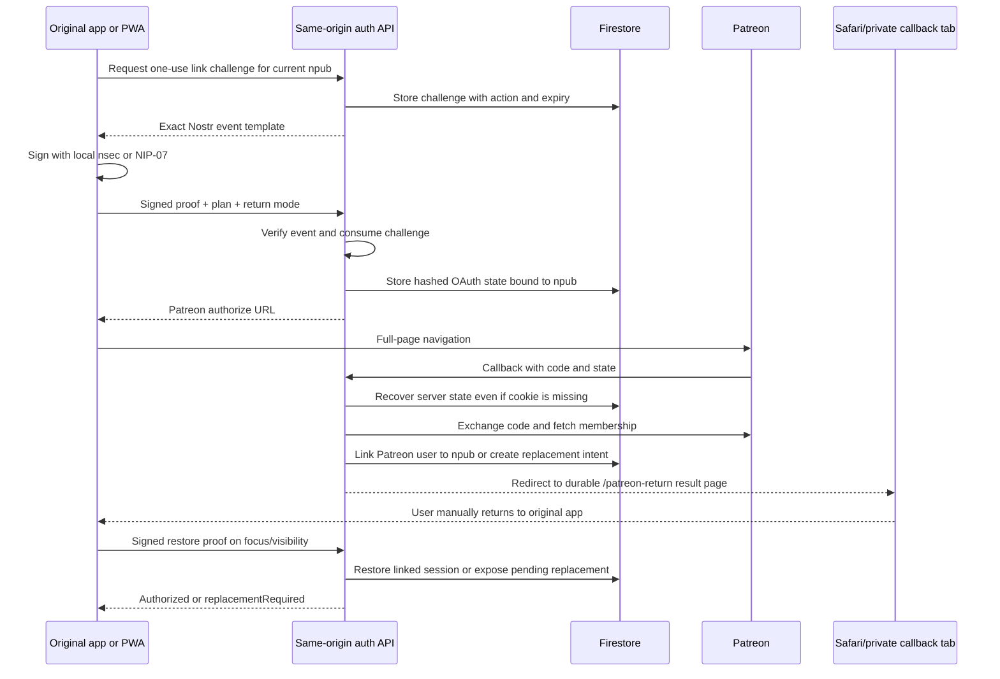

# Patreon Login Fix

## Purpose

This is the portable implementation guide for the Patreon login system that now works in Piyali on desktop, mobile Safari, Safari Private Browsing, installed PWAs, and social-media in-app browsers that hand OAuth to another app or browser.

Use it to repair the equivalent Patreon flow in another Nostr-key-based application without repeating the popup, redirect, cookie, storage, and asynchronous-state bugs encountered in Piyali.

This document describes the final working architecture. It is not a record of every experimental patch, and it contains no production secrets.

The critical principle is:

> Patreon OAuth may finish in a completely different browser storage container from the app that started it. Completion must therefore be recoverable from server state and possession of the original Nostr key—not from popup state, local storage, or a callback cookie alone.

## Reference implementation

The Piyali source of truth is:

- Backend handler: `functions/patreon.js`
- Function registration and secrets: `functions/index.js`
- Backend tests: `functions/patreon.test.js`
- Frontend orchestration: `src/App.jsx`
- Durable callback screen: `src/components/PatreonOAuthDrawerReturn.jsx`
- Callback return bookkeeping: `src/utils/patreonDrawerReturn.js`
- Nostr proof creation: `src/utils/patreonNostrProof.js`
- Firebase Hosting rewrite: `firebase.json`
- PWA service-worker exclusion: `vite.config.js`
- Firestore TTL policies: `firestore.indexes.json` (the target port must also
  add the `patreonLinkRecoveryResumes.expiresAt` policy described below)

Port behavior and security invariants rather than blindly copying Piyali names, URLs, collection names, branding, or Firebase project settings.

## The mobile failure we fixed

The failing real-world sequence was:

1. The user started in an installed PWA or an Instagram in-app browser.
2. Patreon briefly opened its native app.
3. Patreon handed the user to Safari, sometimes a private/incognito tab.
4. The user logged into Patreon and pressed **Allow**.
5. The callback returned to the app's website in Safari.
6. The callback displayed **Patreon connection incomplete**.
7. Opening the app URL in that Safari tab showed the landing page as if the user had been logged out.
8. Returning to the original PWA still showed the paywall.

There were multiple underlying problems:

- A PWA, an in-app browser, regular Safari, and Safari Private Browsing have separate cookie and local-storage containers.
- iOS controls app-to-app handoff. A web application cannot reliably force Safari back into the exact PWA or embedded browser that started OAuth.
- A popup-based flow depends on `window.opener`, popup messaging, and shared browser state. Those assumptions fail across apps, PWAs, private tabs, and popup blockers.
- A callback cookie can be dropped or isolated by Safari/ITP during the cross-site round trip.
- A key-replacement recovery cookie created in Safari is unavailable to the original PWA.
- The original frontend allowed older, slower status requests to overwrite a newer successful result, producing a brief success followed by a return to the paywall.
- The callback page treated every non-`connected` result as a generic incomplete failure, hiding actionable results such as `replace_required`.
- An **Open App** button opened the domain in the current private Safari container. That context did not possess the user's local Nostr key, so it looked like a logout even though the original PWA had not been logged out.

## What the apparent logout really was

The app did not necessarily erase the user's original session or Nostr key. Safari Private simply opened a new copy of the site with empty storage.

Never promise that a callback can reopen the original PWA. The stable UX is:

1. Finish Patreon in whichever browser iOS selects.
2. Show a durable, localized completion screen.
3. Tell the user to close that tab and return to the original app.
4. When the original app regains focus, let it securely recover the result using its Nostr key.

Do not put an **Open App** button on the cross-browser callback unless the product has a properly configured native universal/app link and has tested every target container. A normal HTTPS link is not sufficient.

## Final architecture



## Non-negotiable design decisions

### 1. Use full-page OAuth, not a popup

Start OAuth with:

```js
window.location.assign(authorizeUrl);
```

Do not make a popup the primary flow. Popups are unreliable when Patreon or iOS changes browser/application context, and `postMessage` cannot bridge unrelated storage containers reliably.

### 2. Keep the API and callback same-origin

The browser-facing endpoints should be:

```text
https://<app-domain>/api/patreon/...
```

Firebase Hosting should rewrite those paths to the Patreon function before the SPA wildcard:

```json
{
  "rewrites": [
    {
      "source": "/api/patreon/**",
      "function": {
        "region": "us-central1",
        "functionId": "patreonAuth"
      }
    },
    { "source": "**", "destination": "/index.html" }
  ]
}
```

Configure the Patreon client with the exact callback:

```text
https://<app-domain>/api/patreon/callback
```

The scheme, host, path, slash, and capitalization must match exactly. A Patreon custom checkout domain is unrelated to the OAuth callback domain.

### 3. Exclude API navigation from the PWA fallback

The service worker must not serve `index.html` for `/api` callback navigations:

```js
VitePWA({
  workbox: {
    navigateFallbackDenylist: [/^\/api(?:\/|$)/],
  },
});
```

Without this exclusion, an installed/stale service worker can intercept the callback before the backend exchanges the authorization code, resulting in a blank screen or a permanently spinning app.

### 4. Bind OAuth to a signed Nostr key

Before creating the Patreon authorization URL:

1. The frontend requests an action-specific challenge.
2. The server stores a five-minute, one-use challenge.
3. The user signs the exact server event using the current `nsec` or NIP-07 extension.
4. The server verifies the event ID, signature, public key, action, content, timestamps, and one-use state.
5. Only then does the server create OAuth state bound to that `npub`.

The supported proof actions in Piyali are:

```text
link | restore | replace | disconnect
```

The backend never receives or stores the user's Nostr private key. It stores the public key/hash and verifies signatures.

### 5. Store OAuth state on the server

Do not depend exclusively on a browser cookie to validate the callback.

Create a random state value, store only its hash as the Firestore document ID, and bind the record to:

- `npub`
- hex public key
- selected plan
- return mode/surface
- pending status
- creation and expiration times

Set a short-lived typed cookie as an additional check, but if Safari drops or isolates that cookie, the callback may recover the short-lived Firestore state by hashing the received `state` parameter.

This fallback is safe because the OAuth state was created only after a valid, one-use Nostr `link` proof. Require an unexpired record with a bound public key; never accept an arbitrary state value merely because it exists in the URL.

### 6. Make callback processing replay-safe

Patreon authorization codes are one-use. Mobile browsers can reload or revisit callbacks, and React/PWA navigation can trigger duplicate processing.

Persist the completion on the OAuth state record:

```text
status: completed
completionResult: connected | checkout_required | replace_required | ...
completionSearchParams: sanitized result metadata
completedAtMs: timestamp
```

If the same callback state is seen again, return the saved completion result instead of exchanging the authorization code twice.

### 7. Use typed values inside Firebase's `__session` cookie

Firebase Hosting forwards the specially named `__session` cookie to rewritten functions. Piyali uses that single transport for multiple purposes and prefixes every value with a type so values cannot be confused:

```text
oauth-state
oauth-link-state
oauth-recovery
auth-session
```

Use `HttpOnly`, `Path=/`, `SameSite=Lax`, a purpose-appropriate `Max-Age`, and `Secure` in production. The server must reject a correctly formatted cookie of the wrong type.

Cookies improve same-browser UX, but they are not the cross-browser source of truth.

### 8. Store browser sessions as hashes

After a successful link or restore:

1. Generate a cryptographically random opaque session ID.
2. Store only `sha256(sessionId)` as the session document ID.
3. Put the raw session ID only in the typed HTTP-only cookie.
4. Bind the session record to both the Patreon-user hash and the Nostr-key hash.
5. Validate both directions of the mapping on every authorization check.

An `npub` header by itself is never authorization.

## The cross-browser restore mechanism

A successful Patreon callback may create its session cookie in Safari while the user intends to continue in the original PWA. The PWA will not receive that cookie.

The recovery path is:

1. The original app calls normal `/status` with credentials.
2. If the response is not authorized and restoration is appropriate, the app creates a signed `restore` proof with its current local Nostr key.
3. The app posts the proof to `/key-status`.
4. The backend finds the link using `sha256(npub)` and checks the reverse Patreon-to-key mapping.
5. The backend re-evaluates cached/fresh membership according to policy.
6. If authorized, it issues a fresh session cookie in the original PWA's own storage container.

This is what makes desktop, PWA, private Safari, and in-app-browser handoffs converge on the same account without sharing local storage.

Only attempt silent restoration when the app itself holds an `nsec` and can sign without an extension prompt. NIP-07 users may require an explicit user action because the extension can display a signing confirmation.

## Cross-browser lost-key replacement

### The cookie-only version that failed

When Patreon identified an already-linked Patreon account from a new Nostr key, the backend created a replacement intent and put its random recovery ID in a Safari cookie.

That worked on desktop because the new key and recovery cookie remained in the same browser. It failed on mobile when:

- the recovery cookie was in Safari Private; and
- the new Nostr key was in the original PWA.

Neither context possessed both pieces.

### The final replacement design

When the callback detects `patreon_account_already_linked`:

1. Verify that the Patreon account currently has an active paid membership.
2. Create a ten-minute replacement record containing the expected old mapping, proposed new public key, encrypted fresh Patreon tokens, and expiry.
3. Store the replacement document under `sha256(randomRecoveryId)`.
4. Also store a short-lived resume pointer under `sha256(newNpub)` containing the recovery document hash and expiry.
5. Return `replace_required`.

The resume pointer is not a bearer credential. It cannot complete a replacement. It is consulted only after the new key signs a valid, one-use `restore` or `replace` challenge.

When the original PWA resumes:

1. `/key-status` consumes a signed `restore` proof.
2. If no normal link exists, it looks for the resume pointer keyed by the proven `npub` hash.
3. It validates the pointer and underlying pending recovery record.
4. It returns `replacementRequired: true`.
5. The app shows a dedicated key-replacement screen.
6. The user confirms and signs a one-use `replace` proof.
7. `/replace-link` uses the recovery cookie if available, or the resume pointer if the cookie is in another browser.
8. The backend force-refreshes Patreon membership before committing.
9. A Firestore transaction verifies the expected old and new mappings, moves the one-to-one link, marks recovery complete, deletes the resume pointer, and creates a session for the new key.
10. Old-key sessions are revoked.

Never automatically move a Patreon link merely because OAuth succeeded. Replacement requires an explicit screen and a valid signature from the new key.

## Frontend status handling and the desktop flash regression

After one experimental fix, desktop appeared connected for a moment and then flashed back to the pre-link paywall. An older `/status` request was finishing after a newer successful request and overwriting current state.

Use a monotonically increasing generation/token for subscription checks:

```js
const generation = ++checkGenerationRef.current;
const isCurrent = () => checkGenerationRef.current === generation;

const result = await fetchStatus();
if (!isCurrent()) return;
applyResult(result);
```

Apply the guard after every awaited step, including the signed restore request. In `finally`, clear loading state only if the request is still current.

When the active Nostr key changes:

- Increment the generation immediately.
- Reset optimistic Patreon authorization.
- Clear prior subscription payload.
- Require the new key to establish its own access.

Never let OAuth callback code write or replace `local_npub`/`local_nsec`. The key that began the signed operation remains authoritative.

## Rechecking when the user returns

The original app should recheck on both window focus and document visibility:

```js
window.addEventListener("focus", recheck);
document.addEventListener("visibilitychange", recheck);
```

Debounce/gate duplicate focus and visibility events so one foreground action does not issue multiple simultaneous requests. Recheck using the normal status-then-signed-restore procedure.

Also recheck when the user opens the Subscription settings surface. This avoids displaying stale paywall data in a drawer/modal that was closed during OAuth.

## Durable callback route

Always route callback results to a dedicated page such as:

```text
/patreon-return?patreon=<sanitized-result>
```

This route must render before onboarding, paywall, or authenticated-app redirects. It must not depend on user data, local storage, or the app being logged in.

Behavior:

- If the callback occurred in the original browser and a fresh local pending-return record exists, finish the internal navigation and reopen the requested drawer/modal.
- If the callback occurred in a different browser container, render a standalone result card.
- For `connected`, explain that the membership was linked and ask the user to return to the original app.
- For action-required results, explain that Patreon was verified and the next step must be completed in the original app.
- For genuine failures, display a sanitized machine-readable result code in small text for diagnosis.
- Tell mobile/private-browser users to close the temporary tab and return to the original app.
- Do not render an ordinary **Open App** website link.

Treat these as action-required rather than generic failures:

```text
checkout_required
not_subscribed
link_conflict
replace_required
replace_rate_limited
```

Expected result codes should be allowlisted before being stored or shown. Sanitize saved return paths so they can only point to same-origin relative paths; reject `//host`, foreign origins, and malformed values.

All local/session storage access on the callback path must be wrapped in `try/catch`. Embedded/private browsers can throw when storage is restricted.

## Endpoint contract

| Endpoint | Method | Purpose |
| --- | --- | --- |
| `/api/patreon/link-challenge` | `POST` | Create an action-specific, one-use Nostr event template. |
| `/api/patreon/link-start` | `POST` | Consume a signed `link` proof, persist server OAuth state, and return the Patreon authorize URL. |
| `/api/patreon/callback` | `GET` | Validate/recover state, exchange the code, verify membership, persist completion, and redirect to the durable result page. |
| `/api/patreon/status` | `GET` | Validate the typed session cookie and both sides of the account mapping. |
| `/api/patreon/key-status` | `POST` | Consume signed `restore` proof, restore cross-session access, or report a pending cross-browser replacement. |
| `/api/patreon/replace-link` | `POST` | Consume signed `replace` proof and atomically transfer a Patreon link to the current key. |
| `/api/patreon/cancel-replacement` | `POST` | Cancel an available replacement intent and clear relevant state. |
| `/api/patreon/refresh-status` | `POST` | Force an authoritative Patreon membership refresh with cooldown protection. |
| `/api/patreon/disconnect` | `POST` | Consume signed `disconnect` proof and remove the app link without cancelling Patreon billing. |
| `/api/patreon/webhook` | `POST` | Authenticate Patreon membership events, revoke or mark links for re-verification, and deduplicate retries. |

Use stable JSON error/result identifiers. Do not parse human-readable backend error text in the UI.

## Firestore data model

Piyali uses these logical collections:

| Collection | Purpose | TTL |
| --- | --- | --- |
| `patreonLinkChallenges` | One-use signed-action challenges. | Yes |
| `patreonOAuthStates` | Nostr-bound OAuth state and replay-safe completion. | Yes |
| `patreonOAuthSessions` | Hashed browser sessions. | Yes |
| `patreonAccountLinks` | Nostr-key-hash to authorized Patreon record. | No |
| `patreonUserLinks` | Patreon-user-hash to Nostr-key-hash reverse mapping. | No |
| `patreonLinkRecoveries` | Pending/completed lost-key replacement state. | Yes |
| `patreonLinkRecoveryResumes` | Short-lived new-key-hash to recovery-hash pointer for cross-browser continuation. | Yes |
| `patreonOAuthAuditEvents` | Sanitized security/audit events. | Yes |
| `patreonWebhookReceipts` | Idempotency receipts for webhook delivery/replay. | Yes |
| `patreonRecoveryRateLimits` | Replacement-abuse counters. | Yes |
| `patreonRefreshRateLimits` | Manual-refresh cooldown counters. | Yes |

Create Firestore TTL policies for every collection marked **Yes**, using its `expiresAt` field. TTL is cleanup, not authorization: every read must still explicitly reject expired records because Firestore deletion is asynchronous.

The cross-browser resume collection was added after Piyali's earlier TTL list. Explicit expiry checks already protect authorization, but the target app must add its TTL policy so expired pointer documents are eventually removed.

If two products use the same Firebase project, namespace every collection or hash input by product. Prefer a separate Firebase project for the second app. Never let one app's disconnect or replacement mutate the other app's mappings.

## Patreon membership rules

OAuth login alone is not entitlement. After exchanging the code, fetch Patreon identity with membership relationships and require:

- Membership belongs to the configured campaign.
- Patron status is active according to the product policy.
- Entitled amount is greater than zero.
- Last charge is acceptable under the product's payment/grace policy.
- Tier is in `PATREON_ALLOWED_TIER_IDS` when tier filtering is configured.

The Patreon campaign ID is not the OAuth client ID, Patreon creator/user ID, or a value guessed from the UI. Confirm it from the campaign/membership API data for a real test member. Two apps may use the same campaign if one membership intentionally unlocks both, but each app should still have a separate OAuth client and secrets.

Store OAuth access and refresh tokens encrypted at rest. Refresh expired access tokens server-side. Never expose either token to the frontend.

## Webhook behavior

Webhooks are a fast invalidation signal, not an authorization grant.

Support the relevant member events:

```text
members:create
members:update
members:delete
members:pledge:create
members:pledge:update
members:pledge:delete
```

For every webhook:

1. Read the exact raw request body.
2. Verify `X-Patreon-Signature` using HMAC-MD5 and the webhook's own secret.
3. Allowlist `X-Patreon-Event`.
4. Reject events for another campaign.
5. Hash the Patreon user ID before mapping it.
6. Deduplicate delivery/replay using a receipt derived from event name, signature, and body hash.
7. For clearly inactive/deleted/payment-invalid state, mark authorization false and revoke linked sessions.
8. For active/update signals, set `verificationRequiredAtMs`; require normal Patreon API evaluation before granting/continuing access.
9. Return `200` for accepted duplicates so Patreon does not keep retrying them.

Do not enable post events; they are unrelated to membership authorization.

The webhook secret belongs only in Firebase Secret Manager. It is not a frontend environment variable and should not appear in repository `.env` files.

## Required configuration for the other app

Create a separate Patreon OAuth client for the other product.

### Firebase Secret Manager

```text
PATREON_CLIENT_SECRET
PATREON_TOKEN_ENCRYPTION_KEY
PATREON_WEBHOOK_SECRET
```

Example commands, entered interactively so secrets do not appear in shell history or source control:

```sh
firebase functions:secrets:set PATREON_CLIENT_SECRET --project <firebase-project-id>
firebase functions:secrets:set PATREON_TOKEN_ENCRYPTION_KEY --project <firebase-project-id>
firebase functions:secrets:set PATREON_WEBHOOK_SECRET --project <firebase-project-id>
```

Bind all three secrets in the `onRequest` function's `secrets` array. Defining a secret in Secret Manager is not sufficient if the deployed function does not declare and read it.

### Non-secret function environment

```text
PATREON_CLIENT_ID=<new app client id>
PATREON_CAMPAIGN_ID=<verified campaign id>
PATREON_REDIRECT_URI=https://<app-domain>/api/patreon/callback
PATREON_APP_URL=https://<app-domain>
PATREON_COOKIE_SECURE=true
PATREON_ALLOWED_TIER_IDS=<optional comma-separated ids>
PATREON_SESSION_DAYS=30
PATREON_STATUS_CACHE_MINUTES=10
PATREON_STALE_GRACE_HOURS=6
PATREON_REFRESH_COOLDOWN_SECONDS=30
```

Keep production configuration reproducible in the Firebase-supported environment file or infrastructure configuration for that project. Do not depend on values manually exported in one developer's terminal.

### Patreon dashboard

1. Register the exact production callback URI.
2. Create the membership webhook using `https://<app-domain>/api/patreon/webhook` or the direct function URL if Hosting is not used.
3. Copy the secret generated for that specific webhook into the matching Firebase secret.
4. Enable member and member-pledge events only.
5. Send a test delivery and require HTTP `200`.
6. Replay/send the test again and require HTTP `200` with idempotent handling.

If a webhook is deleted and recreated, it receives a new secret. Update Secret Manager and redeploy the function before testing the new webhook.

## UI behavior to port

### Primary paywall

- Use one Patreon membership card when monthly and annual billing represent the same tier.
- Clearly recommend annual billing but do not imply the app can force Patreon's annual toggle.
- Use one primary **Subscribe with Patreon** action that can link an existing member or start checkout for a new member.
- Do not add a second redundant **Connect with Patreon** block to the standard paywall.
- Do not use a shared passcode or unverifiable one-time Patreon post purchase as a parallel authorization bypass.

### Legacy passcode migration

Existing passcode users should see a dedicated explanation rather than the normal sales paywall. Tell them that they already have access history and only need to connect Patreon; do not imply they must subscribe again.

### Key replacement

Use a dedicated full-screen view/surface. Explain that access moves to the current key, the old key loses subscription access, and learning data does not automatically move between Nostr identities.

### Account settings

The Subscription tab/drawer should query live status when opened and show only sanitized fields. App-controlled actions may refresh, reconnect, replace, or disconnect. Billing, tier changes, payment details, and cancellation remain on Patreon.

### Localization

Localize every return state, error, action-required screen, replacement confirmation, settings label, and accessibility label. The callback route must choose a safe fallback language from browser preferences when app storage is unavailable.

## What not to copy from the failed versions

- Do not use a popup as the canonical OAuth transaction.
- Do not rely on `window.opener`, `postMessage`, or polling popup closure.
- Do not rely on local storage to prove OAuth completion.
- Do not require the callback browser to possess the app's Nostr key.
- Do not require the original PWA to possess Safari's recovery cookie.
- Do not authorize a request from a public `npub` header alone.
- Do not mutate the active Nostr identity from callback parameters or saved OAuth state.
- Do not let a callback path fall through onboarding/paywall redirects.
- Do not let the service worker handle `/api/patreon/callback`.
- Do not exchange an OAuth code again when a completed state record exists.
- Do not let stale async status requests overwrite newer results.
- Do not label `replace_required` or `checkout_required` as generic OAuth failure.
- Do not send users into a private Safari copy of the site with a normal **Open App** link.
- Do not treat webhook update events as proof that access should be granted.
- Do not store raw session IDs, recovery IDs, OAuth state, Patreon tokens, Patreon user IDs, or Nostr private keys in logs.

## Implementation order

1. Decide Firebase-project isolation and campaign/tier policy.
2. Create the other app's Patreon OAuth client and exact callback URI.
3. Add the same-origin Hosting rewrite and PWA `/api` denylist.
4. Implement typed cookies, Nostr challenges, server-backed OAuth state, and replay-safe callback completion.
5. Implement one-to-one link storage and signed key restoration.
6. Implement cross-browser replacement intent and resume pointer.
7. Add race-safe frontend status orchestration and focus/visibility rechecks.
8. Add the durable callback route ahead of onboarding/auth guards.
9. Port the paywall, migration, replacement, and Subscription settings surfaces with full localization.
10. Configure TTL policies.
11. Configure secrets and non-secret production environment.
12. Deploy the backend first while keeping the new UI hidden.
13. Configure and test the webhook.
14. Deploy the frontend and service worker together.
15. Run the complete desktop/mobile matrix before enabling broadly.

The frontend and final backend must be compatible when the UI becomes visible. The cross-browser replacement fix specifically requires both the updated backend and frontend.

## Required automated tests

### Backend

- Challenge creation and exact signed-event verification.
- Wrong action, wrong key, expired challenge, tampered event, and replay rejection.
- OAuth state recovery when the callback cookie is missing.
- Callback replay returns persisted completion without reusing the code.
- Active member link and session creation.
- Non-member checkout-required result.
- Forward/reverse mapping consistency.
- Signed key restore creates a session in a different browser context.
- Signed restore discovers a pending replacement created in another browser.
- Signed replacement succeeds without the recovery cookie when the resume pointer is valid.
- Resume pointer cannot bypass a signature, key match, expiry, or membership recheck.
- Replacement transaction moves only the expected mapping and revokes old sessions.
- Active-key disconnect requires a signed proof.
- Webhook signature, event allowlist, campaign check, invalidation, duplicate delivery, and replay handling.
- Tokens and raw identifiers do not leak in API responses or audit events.

### Frontend

- Callback return paths reject external/open-redirect values.
- Unknown result codes become a safe generic error.
- Storage denial does not crash the callback page.
- Active-key change clears prior authorization immediately.
- Older status response cannot overwrite a newer success.
- Focus/visibility recheck is gated against duplicates.
- `replace_required` selects the dedicated replacement scene.
- The subscription drawer/modal reopens only for the same Nostr key.

## Manual production test matrix

Use real test Patreon accounts and a disposable Nostr key where appropriate.

| Environment | Scenario | Expected result |
| --- | --- | --- |
| Desktop normal browser | Existing active member | OAuth returns, app links, no success-then-paywall flash. |
| Desktop normal browser | Callback reload/back | Saved result returns; authorization code is not exchanged twice. |
| iOS Safari | Existing active member | Link succeeds and status persists after a new tab/session. |
| Safari Private | Existing active member | Callback instructs return; original app restores with signed key. |
| Installed iOS PWA | Patreon opens Safari/app | Original PWA restores when foregrounded. |
| Instagram/in-app browser | Patreon app to Safari handoff | Temporary callback page is stable; original context finishes on return. |
| Any mobile context | Patreon account linked to old key | Original app discovers replacement, confirmation works without Safari cookie. |
| Any browser | Active app key changed | Old key's authorization is never reused optimistically. |
| Any browser | Not subscribed | Clear checkout-required scene, not generic OAuth failure. |
| Any browser | OAuth cancelled | Clear cancelled/error result; account mapping unchanged. |
| Any browser | Slow/duplicated status requests | Latest request wins; UI does not flash back to paywall. |
| Patreon webhook UI | First test delivery | HTTP `200`; receipt recorded. |
| Patreon webhook UI | Same/replayed test | HTTP `200`; no duplicate state mutation. |

For the mobile handoff test, verify the original PWA's key before starting, complete Patreon in the browser iOS chooses, close the callback tab, and manually return to the original PWA. Automatic app switching is not a correctness requirement because the browser/OS controls it.

## Diagnostic checklist

When a mobile attempt fails, record the callback result code and determine which stage failed:

```text
state_error             OAuth state missing, expired, mismatched, or not recoverable
oauth_error             Code exchange, identity fetch, or unexpected callback failure
oauth_cancelled         User/provider cancelled authorization
not_subscribed          Patreon identity lacks accepted paid membership
checkout_required       Auth succeeded; user must subscribe/finish checkout
link_conflict           Current Nostr key is linked incompatibly
replace_required        Patreon is linked to an older Nostr key
replace_rate_limited    Replacement creation was throttled
connected               Link succeeded; original app may still need signed restore
unavailable             Server/configuration problem
```

Then check:

- Function revision and deployment time.
- Exact configured callback URL in both Patreon and the function environment.
- Hosting rewrite order.
- Service-worker cache and `/api` denylist.
- Firestore OAuth state record and expiration.
- Forward and reverse link consistency.
- Pending recovery plus new-key resume pointer.
- Whether the user returned to the original app or opened a new private copy.
- Whether an older frontend status request overwrote a newer result.
- Sanitized function logs and audit events—never raw codes, tokens, signatures, or keys.

## Deployment and rollback

Before shipping:

```sh
npm test
(cd functions && npm test)
npm run build
```

Deploy backend changes before or together with the matching UI. For Firebase Hosting and the Piyali-style function this is conceptually:

```sh
firebase deploy --only functions:patreonAuth,hosting --project <firebase-project-id>
```

Use the other app's actual deployment workflow and do not copy a project ID from Piyali.

After deployment:

1. Confirm the deployed function has all three Secret Manager bindings.
2. Confirm non-secret environment values on the deployed revision.
3. Test the same-origin callback directly through Hosting.
4. Send and replay a real Patreon webhook test.
5. Test desktop first.
6. Test iOS PWA and Instagram/in-app-browser handoff with a real member.
7. Test old-key replacement across separate browser containers.
8. Confirm a new PWA/service-worker build is active.

Rollback the frontend if mobile tests fail, but preserve compatible backend schema where possible. Do not roll back to a public-key-only authorization fallback or a shared passcode bypass.

## Security invariants

- No Nostr private key leaves the client.
- Every link, restore, replacement, and disconnect operation is bound to a short-lived one-use signature.
- Public keys, headers, callback query parameters, and local-storage flags are not authorization by themselves.
- OAuth state is random, hashed at rest, short-lived, bound to the signed key, and replay-safe.
- Sessions are random, hashed at rest, typed in cookies, and checked against both mapping directions.
- Tokens are encrypted at rest and never returned to the client.
- One Patreon user maps to one application key unless the product explicitly chooses a different policy.
- Cross-browser recovery pointers contain no bearer secret and work only after signed proof.
- Replacement is explicit, membership is rechecked, and the mapping move is atomic.
- Webhook signatures use the exact raw body; duplicate deliveries are idempotent.
- Webhooks may revoke or demand verification but never grant access by themselves.
- All expiration checks happen during reads; TTL deletion is only cleanup.
- Logs and analytics never contain `nsec`, OAuth authorization codes, raw access/refresh tokens, raw session IDs, raw recovery IDs, or full signed events.

## Definition of done

The port is complete only when:

- Desktop OAuth works without a success/paywall flash.
- Mobile Safari, Safari Private, PWA, and in-app-browser handoffs complete through manual return to the original app.
- A same-key member restores in the original context without sharing browser storage.
- An old-key Patreon member can explicitly replace the link from the original context without sharing Safari's cookie.
- Callback replay is safe.
- Key changes cannot inherit another key's optimistic access.
- The callback page never strands behind onboarding or a loading spinner.
- The service worker never intercepts Patreon API/callback navigation.
- Webhook delivery and replay return `200` and behave idempotently.
- Automated backend, frontend, localization, and production-build checks pass.
- All target-app secrets, domains, campaign/tier policy, collections, and branding have been replaced rather than copied from Piyali.
